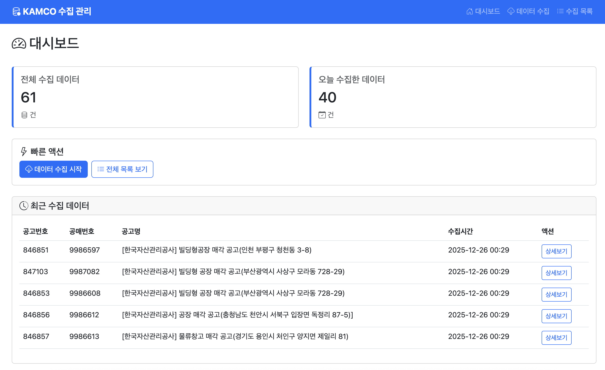
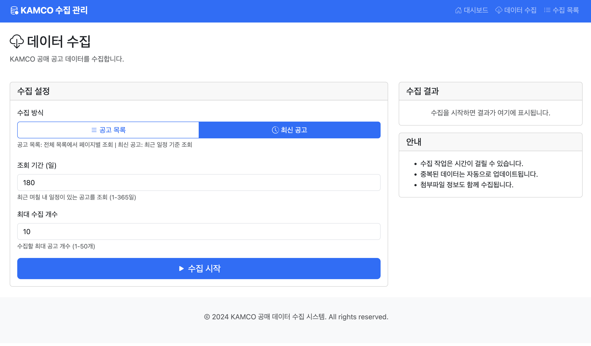
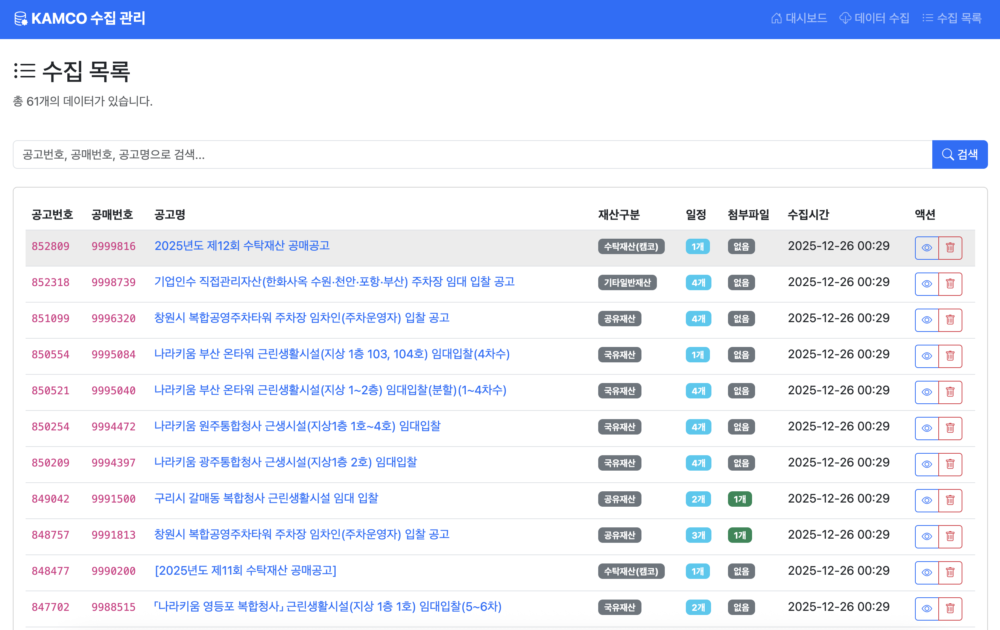
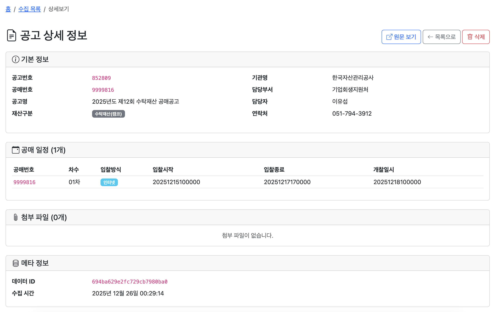

# KAMCO Data Collector

[](https://www.python.org/downloads/)
[](https://fastapi.tiangolo.com/)
[](https://flask.palletsprojects.com/)
[](https://www.mongodb.com/)
[](https://qdrant.tech/)
[](https://ollama.ai/)
[](#-license)

An integrated solution for collecting, normalizing, and analyzing KAMCO (Korea Asset Management Corporation) public auction data using RAG (Retrieval-Augmented Generation).

## 📸 Screenshots

### Dashboard


### Data Collection Interface


### Data List View


### Detailed View


## ✨ Features

- 🔍 Automated data collection from KAMCO OpenAPI
- 📊 Data normalization and structuring
- 🤖 RAG-based vector search with local LLM
- 🌐 FastAPI RESTful endpoints
- 💾 MongoDB + Qdrant vector database
- 🧠 Ollama local LLM integration
- 🖥️ Web-based management interface

## 🏗️ Architecture

```
[Cloudflare Front]
        ↓
[Cloudflare Workers]
        ↓ (Tunnel)
[Mac mini / Server]
 ├─ FastAPI (/ask endpoint)
 ├─ MongoDB (raw + metadata)
 ├─ Qdrant (vector store)
 ├─ Ollama (LLM & Embedding)
 └─ Collector (KAMCO OpenAPI)
```

## 📋 Prerequisites

### 1. MongoDB 7.0
```bash
brew tap mongodb/brew
brew install mongodb-community@7.0
brew services start mongodb-community
```

### 2. Ollama
```bash
brew install ollama
ollama pull qwen2.5:latest
```

### 3. Qdrant
```bash
docker run -d \
  --name qdrant \
  -p 6333:6333 \
  -v ~/qdrant:/qdrant/storage \
  qdrant/qdrant
```

### Database Schema
```
kamco
 ├─ raw_items          # Raw API responses
 ├─ normalized_items   # Normalized text data
 └─ chunks             # Chunked data for RAG (matches Qdrant payload)
```

## 🚀 Installation

```bash
git clone https://github.com/yourusername/kamco-data-collector.git
cd kamco-data-collector
python -m venv .venv
source .venv/bin/activate  # On Windows: .venv\Scripts\activate
pip install -r requirements.txt
```

## ⚙️ Configuration

Create a `.env` file in the project root:

```env
# KAMCO API Key (get from https://www.data.go.kr/)
KAMCO_API_KEY=your_api_key_here

# MongoDB Configuration
MONGO_URI=mongodb://localhost:27017
MONGO_DB_NAME=kamco
MONGO_COLLECTION_NAME=collected_items

# Qdrant Configuration
QDRANT_HOST=localhost
QDRANT_PORT=6333
QDRANT_COLLECTION=kamco

# Ollama Models
EMBED_MODEL=qwen2.5:latest
GEN_MODEL=qwen2.5:latest

# Flask Secret Key (for web interface)
FLASK_SECRET_KEY=your_random_secret_key_here
```

## 📖 Usage

### Data Collection Pipeline

#### 1. Collect Data
Fetch raw data from KAMCO OpenAPI and store in MongoDB:
```bash
python collector/kamco_fetcher.py
```

#### 2. Normalize Data
Convert raw data to human-readable text format:
```bash
python normalize/kamco_normalizer.py
```

#### 3. Embed Data
Generate embeddings and store in Qdrant vector database:
```bash
python rag/embed.py
```
⚠️ **Note**: `setup_collection()` recreates the collection, deleting existing data.

#### 4. Start RAG API Server
```bash
uvicorn api.main:app --host 0.0.0.0 --port 8000
```

Available endpoints:
- `GET /ask?q=your_question` - RAG-based question answering (Top-5 vector search)
- `GET /health` - Health check

### Web Interface

Start the Flask web application:
```bash
python web/app.py
```

Access at `http://localhost:5000`

## 🔧 Cloudflare Tunnel Setup (Optional)

For external access via Cloudflare Workers:

```bash
cloudflared tunnel create kamco-rag
cloudflared tunnel run kamco-rag
```

Configure Workers to proxy `/ask` endpoint to your local FastAPI server.

## 🧪 Testing

### API Integration Test
```bash
python test_api.py
```

### Unit Tests
```bash
pytest
```

### Test Coverage
```bash
pytest --cov=. --cov-report=html
```

## 📁 Project Structure

```
kamco-data-collector/
├── api/
│   └── main.py                # FastAPI RAG endpoints
├── collector/
│   └── kamco_fetcher.py       # KAMCO OpenAPI data collector
├── normalize/
│   └── kamco_normalizer.py    # Data normalization
├── rag/
│   └── embed.py               # Embedding & Qdrant operations
├── services/
│   └── kamco_collector_service.py  # Service layer
├── web/
│   ├── app.py                 # Flask web interface
│   ├── templates/             # HTML templates
│   └── static/                # Static assets
├── tests/                     # Test files
├── screenshots/               # Application screenshots
├── requirements.txt
├── .env.example               # Example environment variables
├── .gitignore
└── README.md
```

## 📚 API Reference

### KAMCO OpenAPI
Get your API key from [공공데이터포털 (data.go.kr)](https://www.data.go.kr/)

- Search for "한국자산관리공사_공매"
- Register and obtain your service key
- Use the URL-encoded version of the key

## 📝 PublicDataReader Library - History and Future Plans

### Background

During development, we evaluated the [PublicDataReader](https://github.com/WooilJeong/PublicDataReader) library, which provides a convenient wrapper around various Korean public data APIs, including KAMCO.

### Why We Didn't Use PublicDataReader

#### Advantages of PublicDataReader:
✅ Returns data as pandas DataFrame for easy analysis  
✅ Automatic Korean column name conversion  
✅ Simple installation via pip  
✅ Unified interface for multiple public APIs  

#### Limitations for Our Use Case:
❌ Difficult to access raw data structure  
❌ Additional external dependencies  
❌ Less control over data processing pipeline  
❌ Not suitable for MongoDB storage workflow  
❌ Limited customization for RAG pipeline  

### Our Custom Implementation Benefits:
✅ Direct XML/Dict data processing  
✅ Built-in MongoDB storage  
✅ Integrated Flask web UI  
✅ Duplicate removal logic  
✅ Minimal external dependencies  
✅ Optimized for RAG pipeline  

### Future Considerations

We maintain PublicDataReader compatibility for users who prefer DataFrame-based analysis:

```python
# Optional: Use PublicDataReader for analysis
import PublicDataReader as pdr
api = pdr.Kamco(service_key)
df = api.get_data(service="캠코공매물건", function="물건목록")
```

### Recommended Approach:
- **Data Collection & Storage**: Use our KamcoCollectorService
- **Data Analysis**: Consider PublicDataReader for exploratory analysis
- **Web Interface**: Use our Flask application
- **RAG Pipeline**: Use our custom implementation

For detailed PublicDataReader test results and comparisons, see [tests/README_PUBLICDATAREADER.md](tests/README_PUBLICDATAREADER.md).

## 🔮 Future Development Plans

### Phase 1: Enhanced Data Collection (Q1 2026)
- [ ] Implement incremental updates (delta sync)
- [ ] Add support for additional KAMCO API endpoints
- [ ] Implement retry logic with exponential backoff
- [ ] Add data validation and quality checks

### Phase 2: Advanced RAG Features (Q2 2026)
- [ ] Multi-language support (English/Korean)
- [ ] Enhanced vector search with hybrid search
- [ ] Implement query expansion techniques
- [ ] Add citation and source tracking

### Phase 3: Production Readiness (Q3 2026)
- [ ] Containerization with Docker Compose
- [ ] Add monitoring and logging (Prometheus/Grafana)
- [ ] Implement API rate limiting
- [ ] Add authentication and authorization
- [ ] Performance optimization and caching

### Phase 4: Advanced Features (Q4 2026)
- [ ] Real-time data streaming
- [ ] Machine learning-based recommendations
- [ ] Advanced analytics dashboard
- [ ] Mobile application support
- [ ] Integration with external platforms


### Development Setup
```bash
# Clone the repository
git clone https://github.com/lhg96/kamco-data-collector.git
cd kamco-data-collector

# Create virtual environment
python -m venv .venv
source .venv/bin/activate

# Install dependencies
pip install -r requirements.txt

# Run tests
pytest
```

## 📄 License

**Custom License - Free for Personal Use, Commercial License Required**

This software is free to use for personal, educational, and non-commercial purposes. Commercial use requires a separate license agreement.

- ✅ **Free**: Personal use, education, research
- ❌ **Requires License**: Commercial use, production deployment, integration into commercial products

For commercial licensing inquiries, please contact: **hyun.lim@okkorea.net**

### Data Attribution

Exchange rate data collected from Investing.com and other public financial data sources. KAMCO auction data provided by Korea Asset Management Corporation through public data portal. Accurate as of December 2024.

## 📞 Contact & Services

### 💼 Development Consulting & Outsourcing Available

We provide professional consulting and development services for IoT, AI, and embedded systems projects.

### 👨‍💼 Project Manager Contact

- **Email**: hyun.lim@okkorea.net
- **Homepage**: https://www.okkorea.net
- **LinkedIn**: https://www.linkedin.com/in/aionlabs/

### 🛠️ Technical Expertise / 기술 전문 분야

- **IoT System Design and Development** / IoT 시스템 설계 및 개발
- **Embedded Software Development** / 임베디드 소프트웨어 개발 (Arduino, ESP32)
- **AI Service Development** / AI 서비스 개발 (LLM, MCP Agent)
- **Cloud Service Architecture** / 클라우드 서비스 구축 (Google Cloud Platform)
- **Hardware Prototyping** / 하드웨어 프로토타이핑

### 💼 Services / 서비스

#### Technical Consulting / 기술 컨설팅
- IoT project planning and design consultation / IoT 프로젝트 기획 및 설계 자문
- System architecture design / 시스템 아키텍처 설계
- Technology stack selection / 기술 스택 선정

#### Development Outsourcing / 개발 외주
- Full-stack development from firmware to cloud / 펌웨어부터 클라우드까지 Full-stack 개발
- Proof of Concept (PoC) development / 개념 검증 개발
- Production-ready system development / 상용 시스템 개발

## 🙏 Acknowledgments

- **KAMCO** (Korea Asset Management Corporation) for providing public auction data
- **[공공데이터포털](https://www.data.go.kr/)** for API access
- **[PublicDataReader](https://github.com/WooilJeong/PublicDataReader)** by WooilJeong for Python library inspiration
- All contributors and users of this project

---

**Made with ❤️ by [OK Korea](https://www.okkorea.net)**
